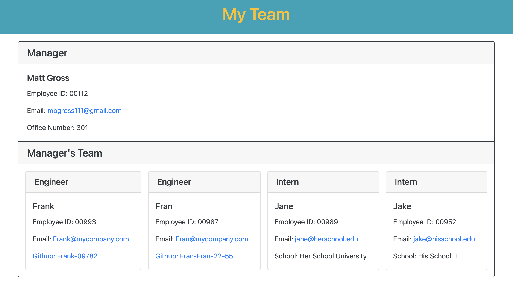

# Employee Page Generator

<div style="position: absolute; top: 22px; right: 50px">


</div>

<a href = "#description"></a>

## Description
Employee Page Generator is a command-line application that accepts user inputs to generate an html file that displays a team roster. Add a manager to your team then add as many engineers and interns as you'd like.


## Table of Contents
  - [Description](#description)
  - [Installation](#installation)
  - [Usage](#usage)
    - [Demo Video](#demo)
  - [Credits](#credits)
  - [License](#license)
  - [Tests](#tests)
  - [Questions](#questions)

<a href = "#installation"></a>

## Installation

- Clone this repository to your machine 
- Make sure you have installed node.js 
- Navigate to the root directory in your terminal ./employee-page-generator
- Run the command ```npm install``` to install necessary dependencies located in package.json file.

<a href = "#usage"></a>

## Usage

- Run the command ```node index.js``` to start the application. 
- Answer the following prompts. 
- When you are finished answering the prompts check your html file here => ./dist/index.html
- When you open ./dist/index.html in the browser, the page should like something like this:



<a href = "#demo"></a>
### Demo Video


<a href = "#credits"></a>

## Credits

- [matt-gross-27](https://github.com/matt-gross-27)


<a href = "#license"></a>

## License
- MIT

<a href = "#tests"></a>

## Tests
- The application uses npm package "Jest" for its testing framework. 
- Run the command ```npm test``` to make sure all Employee object constructors are functioning as expected
`
<a href = "questions"></a>

## Questions
Feel free to reach out with any question you have about Employee Page Generator!

### Contact information:
- GitHub: [matt-gross-27](https://www.github.com/matt-gross-27)
- Email: [mbgross111@gmail.com](mailto:mbgross111@gmail.com)